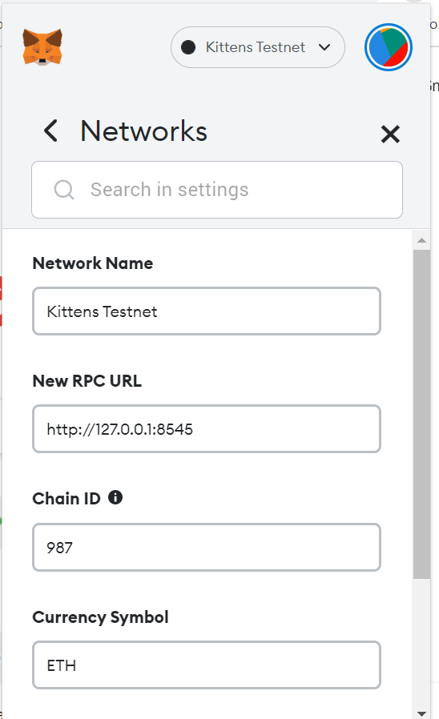

# DevOps Sprint

This project is inspired by The Mumbai Testnet being down during one of the super long weekend in May 2022. I had to spend my whole super long weekend migrating everything from the Mumbai testnet to the Avalanche Fuji Testnet.

So here it is to create my own Kittens Testnet, create and test smart contracts on my private local Kittens Testnet. Step by steps details of launching a local private blockchain can be found at the private-blockchain folder

## The private Ethereum network - Kittens Testnet

Ethereum network is a peer-to-peer network consists of multiple nodes running the Ethereum client such as Geth. More Details can be found at the private blockchain folder

In this Demo, we are setting up a private network with 3 nodes as follows:

  * Bootnode — the bootstrap node that is used for peer discovery purpose. It listens on port 30310, the other nodes joining the network connect to this bootnode first.
  * JSON-RPC endpoint and also a miner— this node exposes JSON-RPC API over HTTP endpoint on port 8545. We will publish the port 8545 of this node container to the host machine to allow external interaction with this private blockchain. This node is also responsible for miningthis node is responsible for mining
  * Miner — this node is responsible for mining (the process of creating a new block in our blockchain). When the miner node successfully mines a new block, it receives the rewards into the configured account.
  * Frontend — testing frondend can be accessed at http://localhost


## Install

1. Clone this repo
2. cd private-blockchain
3. docker-compose up -d (you need to have docker and docker-compose installed in your terminal)


## Import custom network(Kittens Testnet into Metamask)
You should see the following:



## Accessing the Geth Console and fund your metamask wallet

Open a new terminal window, please enter this command:

```
docker exec -it geth-miner-1 bash
```

Then, please enter this command:

```
eth attach /root/miner/node1/ethereum1\\geth.ipc
```

Get ready to fund your metamask wallet with 300ETH by typing: 

```
eth.sendTransaction({from: "0x8fc813d81e623f9c80fe218cd770c024e57d7ae7",to: "<YOUR METAMASK WALLET ADDRESS>", value: "300000000000000000000"})
```

## Ready and Automations

You are now ready to launch your own Smart Contracts. Sample smart contracts, test scripts, front end can all be found at the folder of smart-contracts. 

Github workflow will trigger auto testing of smart contracts, dockerising frontend into Nginx web server and pushing to Dockerhub.

## Killing Dockers

Lastly, you can kill all containers by typing:
```
docker-compose down
```


